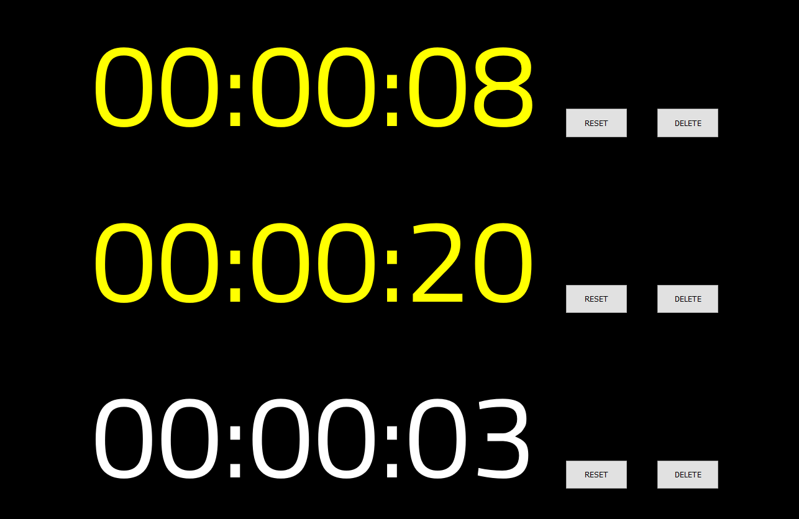

# Multiple Big Timers

I wanted to display multiple timers during a show and could not find something simple, so I created it in React.

Afterwards I realized I could probably have done it in pure Javascript and it would be 20% of the size and complexity, and would be easier to host somewhere.

So here you can find the code and maybe do something with it, at least I had a good coding exercise.

